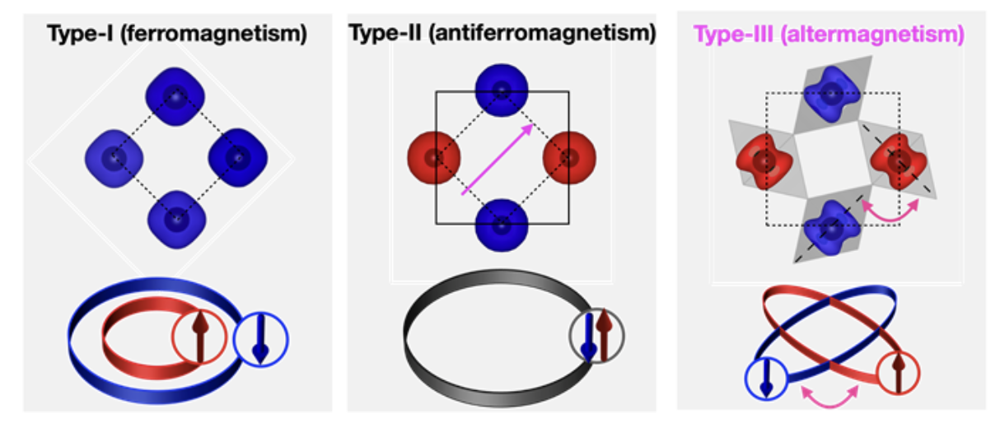
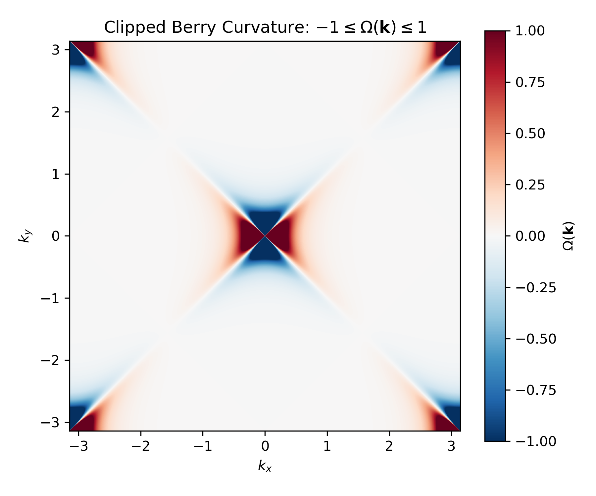

# Quantum Transport in Altermagnetic Materials 🧲⚡



A modern C++ toolkit for simulating quantum transport phenomena in altermagnetic materials, inspired by the groundbreaking work in *Physical Review X 12, 031042 (2022)*, using both Kubo and Boltzmann formalisms.

## 🌟 Key Features

- **Advanced Transport Calculations**: Compute conductivity (σ) and thermoelectric (α) tensors
- **Dual Solver Support**: Both Kubo and Boltzmann transport formalisms implemented
- **Parallel Computing**: OpenMP-accelerated calculations
- **Comprehensive Analysis**: Berry curvature, DOS, and band structure capabilities
- **Modern C++**: Clean, templated code with Eigen integration
- **Visualization Ready**: Jupyter notebooks for post-processing included

## 📦 Installation & Setup

### Prerequisites

- **Compiler**: GCC ≥ 9.0 or Clang ≥ 10.0
- **Dependencies**:
  - Eigen3 (≥ 3.3.7)
  - OpenMP
  - CMake (≥ 3.12)
  - Python (for post-processing)

### 🚀 Quick Start (Linux/macOS)

```bash
# Clone the repository
git clone https://github.com/yourusername/quantum-transport-altermagnets.git
cd quantum-transport-altermagnets

# Create build directory
mkdir build && cd build

# Configure and build
cmake -DCMAKE_BUILD_TYPE=Release ..
make -j4

# Run an example
./bin/example_altermagnet_conductivity 4
```

## 🧮 Running Simulations

### Configuration File

The `params.ini` file should be placed in your working directory (typically the build directory). An example configuration:

```ini
[System]
J = 0.0:1.0:0.025      # J values (start:end:step)
lambda = 0.0,0.1,0.5   # Spin-orbit coupling values
mesh_points = 250      # k-point resolution

[Transport]
Ef = 0.5               # Fermi energy
temperature = 0.02     # Reduced temperature
eta = 1e-2             # Kubo broadening
tau = 100.0            # Relaxation time
```

### Basic Usage

```bash
# Run from build directory
cd build

# Conductivity calculation (4 threads)
./bin/example_altermagnet_conductivity 4

# Berry curvature calculation
./bin/example_altermagnet_berry


```

## 📊 Post-Processing

```bash
# Launch Jupyter notebook server from project root
jupyter notebook postprocessing/plot_berry.ipynb

```



## 🧩 Code Structure

```
quantum-transport-altermagnets/
├── bin/                # Compiled executables (in build directory)
├── params.ini          # Example configuration file
├── include/            # Header files
├── src/                # Core implementation
├── examples/           # Example source code
├── data/               # Output data
├── postprocessing/     # Visualization scripts
└── tests/              # Unit tests
```

## 🤝 Contributing

We welcome contributions! Please see our [Contribution Guidelines](CONTRIBUTING.md).

## 📜 License

MIT License - See [LICENSE](LICENSE) for details.

---

**Get Started Now** - Unlock the secrets of quantum transport in altermagnets! ✨

```bash
git clone https://github.com/yourusername/quantum-transport-altermagnets.git
```

